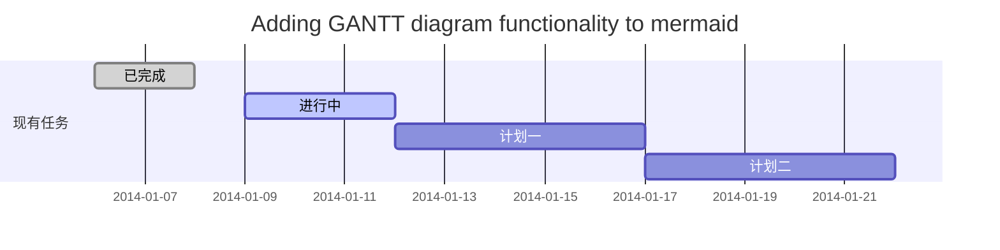
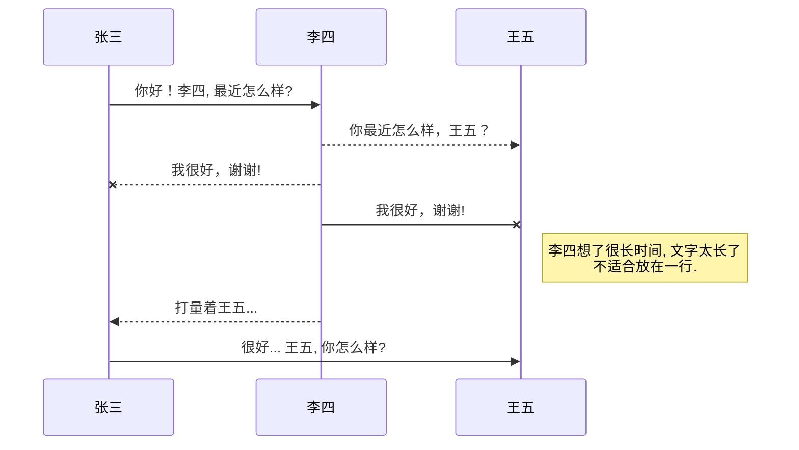
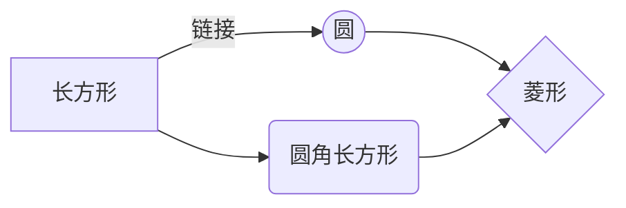

@[TOC](这里写自定义目录标题)

# GD32V103 引导代码分析

**GD32V103**是兆易发布的全新**RISC-V处理器**，基于**RV32IMAC指令集**，由于采用了全新的CPU内核，GD32V103的引导和中断向量表与基于**ARM Cortex-M3 CPU**的GD32F系列有很大差异。它的引导代码位于
[start.S](https://github.com/riscv-mcu/GD32VF103_Firmware_Library/blob/master/Firmware/RISCV/env_Eclipse/start.S)，本文对start.S中的引导代码进行分析解释。


## [start.S](https://github.com/riscv-mcu/GD32VF103_Firmware_Library/blob/master/Firmware/RISCV/env_Eclipse/start.S)的编译方法

由于[start.S](https://github.com/riscv-mcu/GD32VF103_Firmware_Library/blob/master/Firmware/RISCV/env_Eclipse/start.S)中引入了[riscv_encoding.h](https://github.com/riscv-mcu/GD32VF103_Firmware_Library/blob/master/Firmware/RISCV/drivers/riscv_encoding.h)文件，这个文件中定义了GD32V103的寄存器地址。由于[riscv_encoding.h](https://github.com/riscv-mcu/GD32VF103_Firmware_Library/blob/master/Firmware/RISCV/drivers/riscv_encoding.h)是个C语言头文件，因此无法用[riscv-binutil](https://github.com/riscv/riscv-binutils-gdb)中的**riscv-none-embed-as**汇编器进行编译，必须使用**riscv-none-embed-gcc**进行编译。
```
riscv-none-embed-gcc -c -x assembler-with-cpp -g -march=rv32imac -mabi=ilp32 -mcmodel=medlow start.S -o start.o
```
## 设置代码段名称
```
.section .init
```
本行指定段名称为.init，在[GD32VF103xB.lds](https://github.com/riscv-mcu/GD32VF103_Firmware_Library/blob/master/Firmware/RISCV/env_Eclipse/GD32VF103xB.lds)中会把.init段设置在flash的首位，在GD32V103中位于地址0x08000000，这个地址是GD32V103固件的入口地址。
## start.S的中断处理函数定义
```
    .weak  eclic_msip_handler   // #3：ECLIC的TIMER单元软中断
    .weak  eclic_mtip_handler   // #7：ECLIC的TIMER单元的计时器中断
    .weak  eclic_bwei_handler   // #17：存储器访问错误中断
    .weak  eclic_pmovi_handler  // #18：根据手册预留，没有使用该中断
    .weak  WWDGT_IRQHandler     // #19：看门狗中断
    .weak  LVD_IRQHandler       // #20：连接到EXTI线的LVD中断
    .weak  TAMPER_IRQHandler    // #21：侵入检测中断
    .weak  RTC_IRQHandler       // #22：RTC全局中断
    .weak  FMC_IRQHandler       // #23：FMC全局中断
    .weak  RCU_IRQHandler       // #24：RCU全局中断
    .weak  EXTI0_IRQHandler     // #25：EXTI线0中断
    .weak  EXTI1_IRQHandler     // #26：EXTI线1中断
    .weak  EXTI2_IRQHandler     // #27：EXTI线2中断
    .weak  EXTI3_IRQHandler     // #28：EXTI线3中断
    .weak  EXTI4_IRQHandler     // #29：EXTI线4中断
    .weak  DMA0_Channel0_IRQHandler // #30：DMA0通道0全局中断
    .weak  DMA0_Channel1_IRQHandler // #31：DMA0通道1全局中断
    .weak  DMA0_Channel2_IRQHandler // #32：DMA0通道2全局中断
    .weak  DMA0_Channel3_IRQHandler // #33：DMA0通道3全局中断
    .weak  DMA0_Channel4_IRQHandler // #34: DMA0通道4全局中断
    .weak  DMA0_Channel5_IRQHandler // #35: DMA0通道5全局中断
    .weak  DMA0_Channel6_IRQHandler // #36: DMA0通道6全局中断
    .weak  ADC0_1_IRQHandler        // #37: ADC0和ADC1全局中断
    .weak  CAN0_TX_IRQHandler       // #38：CAN0发送中断
    .weak  CAN0_RX0_IRQHandler      // #39：CAN0接收0中断
    .weak  CAN0_RX1_IRQHandler      // #40：CAN0接收1中断
    .weak  CAN0_EWMC_IRQHandler     // #41：CAN0 EWMC中断
    .weak  EXTI5_9_IRQHandler       // #42：EXTI[9:5]中断
    .weak  TIMER0_BRK_IRQHandler    // #43：TIMER0中止中断
    .weak  TIMER0_UP_IRQHandler     // #44：TIMER0更新中断
    .weak  TIMER0_TRG_CMT_IRQHandler    // #45：TIMER0触发和通道换相
    .weak  TIMER0_Channel_IRQHandler    // #46：TIMER0通道捕获比较
    .weak  TIMER1_IRQHandler        // #47：TIMER1全局中断
    .weak  TIMER2_IRQHandler        // #48：TIMER2全局中断
    .weak  TIMER3_IRQHandler        // #49：TIMER3全局中断
    .weak  I2C0_EV_IRQHandler       // #50：I2C0事件中断
    .weak  I2C0_ER_IRQHandler       // #51：I2C0错误中断
    .weak  I2C1_EV_IRQHandler       // #52：I2C1事件中断
    .weak  I2C1_ER_IRQHandler       // #53：I2C1错误中断
    .weak  SPI0_IRQHandler          // #54：SPI0全局中断
    .weak  SPI1_IRQHandler          // #55：SPI1全局中断
    .weak  USART0_IRQHandler        // #56：USART0全局中断
    .weak  USART1_IRQHandler        // #57：USART1全局中断
    .weak  USART2_IRQHandler        // #58：USART2全局中断
    .weak  EXTI10_15_IRQHandler     // #59：EXTI[15:10]中断
    .weak  RTC_Alarm_IRQHandler     // #60：连接到EXTI线的RTC闹钟
    .weak  USBFS_WKUP_IRQHandler    // #61：连接到EXTI线的USB唤醒
    .weak  EXMC_IRQHandler          // 
    .weak  TIMER4_IRQHandler        // #69：TIMER4全局中断
    .weak  SPI2_IRQHandler          // #70：SPI2全局中断
    .weak  UART3_IRQHandler         // #71：UART3全局中断
    .weak  UART4_IRQHandler         // #72：UART4全局中断
    .weak  TIMER5_IRQHandler        // #73：TIMER5全局中断
    .weak  TIMER6_IRQHandler        // #74：TIMER6全局中断
    .weak  DMA1_Channel0_IRQHandler // #75：DMA1通道0全局中断
    .weak  DMA1_Channel1_IRQHandler // #76：DMA1通道1全局中断
    .weak  DMA1_Channel2_IRQHandler // #77：DMA1通道2全局中断
    .weak  DMA1_Channel3_IRQHandler // #78：DMA1通道3全局中断
    .weak  DMA1_Channel4_IRQHandler // #79：DMA1通道4全局中断
    .weak  CAN1_TX_IRQHandler       // #80：CAN1发送全局中断
    .weak  CAN1_RX0_IRQHandler      // #81：CAN1接收0中断
    .weak  CAN1_RX1_IRQHandler      // #82：CAN1接收1中断
    .weak  CAN1_EWMC_IRQHandler     // #83：CAN1 EWMC中断
    .weak  USBFS_IRQHandler         // #84：USB FS全局中断

```
和STM32一样，中断处理函数使用弱引用定义，这样如果中断处理函数没有被实现也不会发生链接器错误。
## GD32V103的中断向量表
中断向量表vector_base被放置在.init段的首部，从flash地址0x08000000开始。和STM32不一样的地方在于，GD32V103的中断向量表实际是由ECLIC控制器CSR寄存器中的**mtvec、mtvt、mtvt2**寄存器指定。

GD32V103的中断控制器具有两种模式：**默认模式**和**ECLIC模式**。模式的设置由mtvec[5:0]指定，当mtvec[5:0]==6'b000011时为ECLIC模式。处理函数入口由mtvec[31:6]指定（处理函数入口地址必须为64字节对齐）。

1. **默认模式**：所有中断，异常，NMI都由mtvec[31:6]指定的处理函数进行处理；
2. **ECLIC模式**：异常，NMI由**mtvec[31:6]**指定的处理函数进行处理，中断由**mtvt寄存器**指定的处理函数进行处理，并由**mtvt2寄存器**指定中断向量表地址

GD32V103 ECLIC的中断向量寄存器
|    寄存器   |全名                          |说明                         
|----------------|-------------------------------|-----------------------------|
|mtvec|Machine Trap-Vector Base-Address Register            |用于配置中断和异常处理程序的入口地址。一般用于处理NMI和异常中断            |
|mtvt          |ECLIC Interrupt Vector Table Base Address            |用于保存ECLIC中断向量表的基地址，此基地址至少为64byte对齐。            |
|mtvt2          |ECLIC non-vectored interrupt handler address register|用于指定ECLIC非向量模式的中断common-code入口地址。|

RISC-V处理器的中断系统和NVIC的中断系统不同，RISC-V的中断系统分为NMI，异常，外部中断三个概念。因此也分由不同的向量寄存器设置入口地址。由于risc-v的中断和异常都不进行自动现场保护，所以需要软件手动进行现场保护处理，因此无法直接使用C函数响应中断，需要一个基于汇编的入口函数进行处理，在汇编入口函数中再对C函数进行调用。

GD32V103在ECLIC中断模式中，mtvec用于保存nmi和异常入口函数地址，不会进行自动的向量表调用。需要由入口函数进行转发处理。在官方代码中，响应函数为[entry.S](https://github.com/riscv-mcu/GD32VF103_Firmware_Library/blob/master/Firmware/RISCV/env_Eclipse/entry.S)中的**trap_entry**函数。

mtvt2用于保存中断响应入口函数地址，处理函数位于[entry.S](https://github.com/riscv-mcu/GD32VF103_Firmware_Library/blob/master/Firmware/RISCV/env_Eclipse/entry.S)中的**irq_entry**，函数mtvt保存向量表地址，mtvt2寄存器的**irq_entry**函数和mtvt寄存器中的向量表共同组成一个two-stage的中断向量表系统，**irq_entry**中对现场进行保护，并触发ECLIC调用中断向量表。

start.S中定义vector_base，vector_base的第一个字放置了一条跳转指令直接跳转到_start，
```
vector_base:
    j _start        // 跳转到_start
    .align    2
    .word     0
    .word     0
    .word     eclic_msip_handler
    .word     0
    .word     0
    .word  	  0
    .word  	  eclic_mtip_handler
    .word  	  0
    .word  	  0
    .word  	  0
    .word  	  0
    .word  	  0
    .word  	  0
    .word  	  0
    .word 	  0
    .word  	  0
    .word  	  eclic_bwei_handler
    .word  	  eclic_pmovi_handler
    .word  	  WWDGT_IRQHandler
	.word     LVD_IRQHandler
	.word     TAMPER_IRQHandler
	.word     RTC_IRQHandler
	.word     FMC_IRQHandler
	.word     RCU_IRQHandler
	.word     EXTI0_IRQHandler
	.word     EXTI1_IRQHandler
	.word     EXTI2_IRQHandler
	.word     EXTI3_IRQHandler
	.word     EXTI4_IRQHandler
	.word     DMA0_Channel0_IRQHandler
	.word     DMA0_Channel1_IRQHandler
	.word     DMA0_Channel2_IRQHandler
	.word     DMA0_Channel3_IRQHandler
	.word     DMA0_Channel4_IRQHandler
	.word     DMA0_Channel5_IRQHandler
	.word     DMA0_Channel6_IRQHandler
	.word     ADC0_1_IRQHandler
	.word     CAN0_TX_IRQHandler
	.word     CAN0_RX0_IRQHandler
	.word     CAN0_RX1_IRQHandler
	.word     CAN0_EWMC_IRQHandler
	.word     EXTI5_9_IRQHandler
	.word     TIMER0_BRK_IRQHandler
	.word     TIMER0_UP_IRQHandler
	.word     TIMER0_TRG_CMT_IRQHandler
	.word     TIMER0_Channel_IRQHandler
	.word     TIMER1_IRQHandler
	.word     TIMER2_IRQHandler
	.word     TIMER3_IRQHandler
	.word     I2C0_EV_IRQHandler
	.word     I2C0_ER_IRQHandler
	.word     I2C1_EV_IRQHandler
	.word     I2C1_ER_IRQHandler
	.word     SPI0_IRQHandler
	.word     SPI1_IRQHandler
	.word     USART0_IRQHandler
	.word     USART1_IRQHandler
	.word     USART2_IRQHandler
	.word     EXTI10_15_IRQHandler
	.word     RTC_Alarm_IRQHandler
	.word     USBFS_WKUP_IRQHandler
    .word     0
    .word     0
    .word     0
    .word     0
	.word     0
	.word     EXMC_IRQHandler
	.word     0
	.word     TIMER4_IRQHandler
	.word     SPI2_IRQHandler
	.word     UART3_IRQHandler
	.word     UART4_IRQHandler
	.word     TIMER5_IRQHandler
	.word     TIMER6_IRQHandler
	.word     DMA1_Channel0_IRQHandler
	.word     DMA1_Channel1_IRQHandler
	.word     DMA1_Channel2_IRQHandler
	.word     DMA1_Channel3_IRQHandler
	.word     DMA1_Channel4_IRQHandler
    .word     0
    .word     0
	.word     CAN1_TX_IRQHandler
	.word     CAN1_RX0_IRQHandler
	.word     CAN1_RX1_IRQHandler
	.word     CAN1_EWMC_IRQHandler
	.word     USBFS_IRQHandler

```

撤销：<kbd>Ctrl/Command</kbd> + <kbd>Z</kbd>
重做：<kbd>Ctrl/Command</kbd> + <kbd>Y</kbd>
加粗：<kbd>Ctrl/Command</kbd> + <kbd>B</kbd>
斜体：<kbd>Ctrl/Command</kbd> + <kbd>I</kbd>
标题：<kbd>Ctrl/Command</kbd> + <kbd>Shift</kbd> + <kbd>H</kbd>
无序列表：<kbd>Ctrl/Command</kbd> + <kbd>Shift</kbd> + <kbd>U</kbd>
有序列表：<kbd>Ctrl/Command</kbd> + <kbd>Shift</kbd> + <kbd>O</kbd>
检查列表：<kbd>Ctrl/Command</kbd> + <kbd>Shift</kbd> + <kbd>C</kbd>
插入代码：<kbd>Ctrl/Command</kbd> + <kbd>Shift</kbd> + <kbd>K</kbd>
插入链接：<kbd>Ctrl/Command</kbd> + <kbd>Shift</kbd> + <kbd>L</kbd>
插入图片：<kbd>Ctrl/Command</kbd> + <kbd>Shift</kbd> + <kbd>G</kbd>
查找：<kbd>Ctrl/Command</kbd> + <kbd>F</kbd>
替换：<kbd>Ctrl/Command</kbd> + <kbd>G</kbd>


## 合理的创建标题，有助于目录的生成

直接输入1次<kbd>#</kbd>，并按下<kbd>space</kbd>后，将生成1级标题。
输入2次<kbd>#</kbd>，并按下<kbd>space</kbd>后，将生成2级标题。
以此类推，我们支持6级标题。有助于使用`TOC`语法后生成一个完美的目录。


## 如何改变文本的样式

*强调文本* _强调文本_

**加粗文本** __加粗文本__

==标记文本==

~~删除文本~~

> 引用文本

H~2~O is是液体。

2^10^ 运算结果是 1024.


## 插入链接与图片

链接: [link](https://mp.csdn.net).

图片: 

带尺寸的图片: 

居中的图片: 

居中并且带尺寸的图片: 

当然，我们为了让用户更加便捷，我们增加了图片拖拽功能。


## 如何插入一段漂亮的代码片

去[博客设置](https://mp.csdn.net/configure)页面，选择一款你喜欢的代码片高亮样式，下面展示同样高亮的 `代码片`.
```javascript
// An highlighted block
var foo = 'bar';
```


## 生成一个适合你的列表

- 项目
  - 项目
    - 项目

1. 项目1
2. 项目2
3. 项目3

- [ ] 计划任务
- [x] 完成任务


## 创建一个表格
一个简单的表格是这么创建的：
项目     | Value
-------- | -----
电脑  | $1600
手机  | $12
导管  | $1

### 设定内容居中、居左、居右
使用`:---------:`居中
使用`:----------`居左
使用`----------:`居右
| 第一列       | 第二列         | 第三列        |
|:-----------:| -------------:|:-------------|
| 第一列文本居中 | 第二列文本居右  | 第三列文本居左 | 


### SmartyPants
SmartyPants将ASCII标点字符转换为“智能”印刷标点HTML实体。例如：
|    TYPE   |ASCII                          |HTML                         
|----------------|-------------------------------|-----------------------------|
|Single backticks|`'Isn't this fun?'`            |'Isn't this fun?'            |
|Quotes          |`"Isn't this fun?"`            |"Isn't this fun?"            |
|Dashes          |`-- is en-dash, --- is em-dash`|-- is en-dash, --- is em-dash|


## 创建一个自定义列表
Markdown
:  Text-to-HTML conversion tool

Authors
:  John
:  Luke


## 如何创建一个注脚

一个具有注脚的文本。[^2]

[^2]: 注脚的解释


##  注释也是必不可少的

Markdown将文本转换为 HTML。

*[HTML]:   超文本标记语言


## KaTeX数学公式

您可以使用渲染LaTeX数学表达式 [KaTeX](https://khan.github.io/KaTeX/):

Gamma公式展示 $\Gamma(n) = (n-1)!\quad\forall
n\in\mathbb N$ 是通过欧拉积分

$$
\Gamma(z) = \int_0^\infty t^{z-1}e^{-t}dt\,.
$$

> 你可以找到更多关于的信息 **LaTeX** 数学表达式[here][1].


## 新的甘特图功能，丰富你的文章


- 关于 **甘特图** 语法，参考 [这儿][2],

## UML 图表

可以使用UML图表进行渲染。 [Mermaid](https://mermaidjs.github.io/). 例如下面产生的一个序列图：:



这将产生一个流程图。:



- 关于 **Mermaid** 语法，参考 [这儿][3],

## FLowchart流程图

我们依旧会支持flowchart的流程图：
```mermaid
flowchat
st=>start: 开始
e=>end: 结束
op=>operation: 我的操作
cond=>condition: 确认？

st->op->cond
cond(yes)->e
cond(no)->op
```

- 关于 **Flowchart流程图** 语法，参考 [这儿][4].


## 导出与导入

###  导出
如果你想尝试使用此编辑器, 你可以在此篇文章任意编辑。当你完成了一篇文章的写作, 在上方工具栏找到 **文章导出** ，生成一个.md文件或者.html文件进行本地保存。

### 导入
如果你想加载一篇你写过的.md文件，在上方工具栏可以选择导入功能进行对应扩展名的文件导入，
继续你的创作。

 [1]: http://meta.math.stackexchange.com/questions/5020/mathjax-basic-tutorial-and-quick-reference
 [2]: https://mermaidjs.github.io/
 [3]: https://mermaidjs.github.io/
 [4]: http://adrai.github.io/flowchart.js/